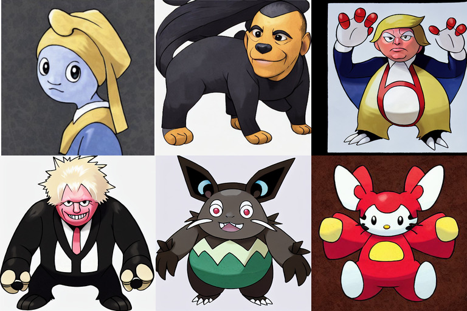

# Experiments with Stable Diffusion

This repository extends and adds to the [original training repo](https://github.com/pesser/stable-diffusion) for Stable Diffusion.

Currently it adds:

- [Fine tuning](#fine-tuning)
- [Image variations](#image-variations)
- [Conversion to Huggingface Diffusers](scripts/convert_sd_to_diffusers.py)

## Fine tuning

Makes it easy to fine tune Stable Diffusion on your own dataset. For example generating new Pokemon from text:

> Girl with a pearl earring, Cute Obama creature, Donald Trump, Boris Johnson, Totoro, Hello Kitty

For a step by step guide see the [Lambda Labs examples repo](https://github.com/LambdaLabsML/examples).

### About GPU Memory! (Fine Tuning / Train)
- A100 40GB(Google Cloud Platform) 
- if you want to train Diffusion(float32) with your own GPU, at least enough 30GB VRAM in "BATCH_SIZE=1" (40GB VRAM enough in BATCH_SIZE=4)
- CUDA out of memory in 3090RTX(24GB)
- Can run in COLAB PRO / COLAB PRO PLUS (Caution: 500 computing Resource will run out only 2days)
